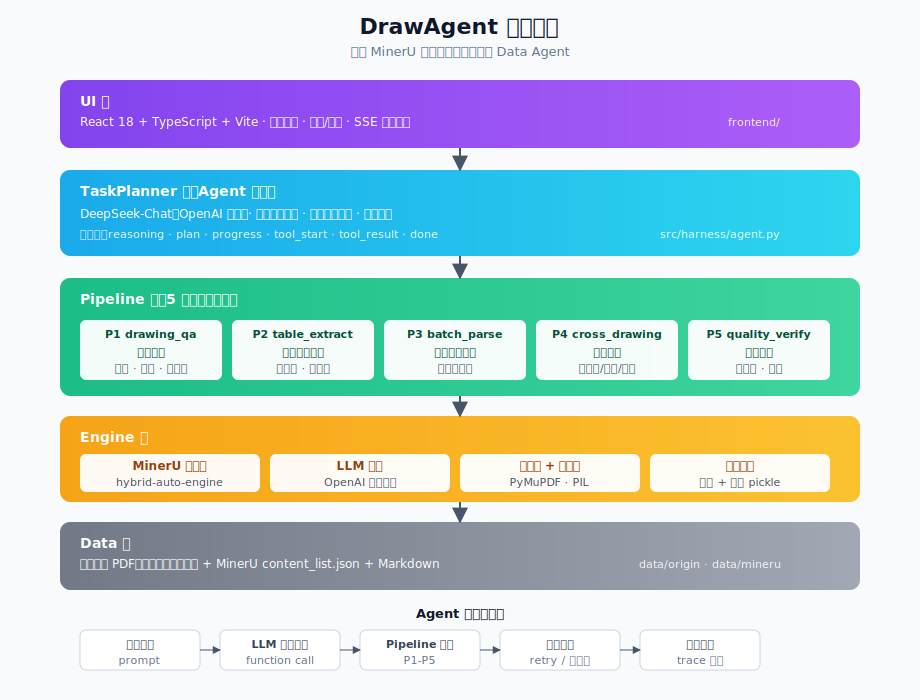

# DrawAgent — 基于 MinerU 的工程图纸智能解析 Data Agent

> **DrawAgent** 是一个面向工程图纸（AEC 领域）的智能文档处理 Data Agent，以 [MinerU](https://github.com/opendatalab/MinerU) 为核心解析引擎，通过 LLM 驱动的任务规划与工具调用，自动完成工程图纸的结构化理解、表格提取、跨图比对与质量验证。

[](LICENSE)
[](https://www.python.org/downloads/)
[](https://github.com/opendatalab/MinerU)



## 项目定位

DrawAgent 聚焦 **工程图纸智能解析** 场景，解决三类常见问题：

1. **工程图纸版面理解** — 图签/标题栏/表格/标注的精准识别与结构化
2. **密集表格精准提取** — 门窗统计表、材料表中数字与合并单元格
3. **跨图纸信息关联** — 多专业图纸间的图号、设计号、目录一致性

## 系统架构

```
┌─────────────────────────────────────────────────┐
│  前端 UI（React + TypeScript + Vite）            │
│  图纸查看 · 点选/框选 · SSE 流式对话              │
├─────────────────────────────────────────────────┤
│  TaskPlanner（Agent 编排层）                      │
│  DeepSeek-Chat · 多步任务规划 · 工具调用循环    │
├─────────────────────────────────────────────────┤
│  Pipeline 层（5 个处理流水线）                     │
│  P1 图纸问答 · P2 表格提取 · P3 批量统计          │
│  P4 跨图比对 · P5 质量验证                       │
├─────────────────────────────────────────────────┤
│  Engine 层                                       │
│  MinerU 解析器（hybrid-auto-engine） · LLM 网关   │
│  渲染器 · 索引器 · 缓存                          │
├─────────────────────────────────────────────────┤
│  数据层                                          │
│  工程图纸 PDF · MinerU 解析结果 · 页面渲染缓存    │
└─────────────────────────────────────────────────┘
```

## 5 个 Pipeline

| Pipeline | 功能 | 典型问题 |
|----------|------|----------|
| P1 drawing_qa | 单图内容问答 | "结构专业负责人是谁？" |
| P2 table_extract | 表格精准提取 | "提取门窗统计表数据" |
| P3 batch_parse | 批量解析统计 | "统计所有图纸的解析结果" |
| P4 cross_drawing | 跨图比对 | "设计号是否一致？" |
| P5 quality_verify | 解析质量验证 | "验证 MinerU 解析质量" |

## 快速开始

### 环境要求

- Python 3.11+
- Node.js 20+
- MinerU 3.1+（含 vLLM）
- GPU（推荐 A100/A800，用于 MinerU 解析）

### 1. 安装后端依赖

```bash
pip install -r requirements.txt
```

### 2. 配置 LLM

创建 `.env` 文件：

```env
LLM_API_KEY=your-api-key
LLM_BASE_URL=https://api.deepseek.com
LLM_MODEL=deepseek-chat
```

### 3. MinerU 解析图纸（首次）

```bash
PYTHONUNBUFFERED=1 MINERU_MODEL_SOURCE=modelscope \
  python -m src.adapters.mineru_real data/origin/ \
  -b hybrid-auto-engine -m auto -l ch -w 4
```

### 4. 启动后端

```bash
python server.py
# → http://127.0.0.1:8000
```

### 5. 启动前端

```bash
cd frontend
npm install
npm run dev
# → http://localhost:5173
```

### 6. API 测试

```bash
# 查看图纸列表
curl http://127.0.0.1:8000/api/drawings

# 对话测试
curl -N -X POST http://127.0.0.1:8000/api/chat \
  -H "Content-Type: application/json" \
  -d '{"prompt": "结构设计说明的设计号是什么？"}'
```

## 项目结构

```
├── contracts/interfaces.py    # 契约层（数据结构 + Protocol 接口）
├── config.py                  # 全局配置
├── server.py                  # FastAPI HTTP 服务
├── src/
│   ├── harness/               # Agent 运行时
│   │   ├── agent.py           # TaskPlanner（任务规划 + 工具调用循环）
│   │   ├── context.py         # Workspace（上下文 / 缓存）
│   │   ├── registry.py        # PipelineRegistry
│   │   ├── indexer.py         # 图纸索引器
│   │   └── renderer.py        # 可视化渲染器
│   ├── pipelines/             # 5 个处理流水线
│   │   ├── base.py            # Pipeline 基础设施
│   │   ├── _common.py         # 共享工具（OCR 纠错、图签提取等）
│   │   ├── p1_drawing_qa/     # 单图问答
│   │   ├── p2_table_extract/  # 表格提取
│   │   ├── p3_batch_parse/    # 批量统计
│   │   ├── p4_cross_drawing/  # 跨图比对
│   │   └── p5_quality_verify/ # 质量验证
│   └── adapters/              # 适配器（MinerU、LLM 的 mock/real 实现）
│       ├── mineru_real.py     # 真实 MinerU 解析器（并行批量解析）
│       ├── mineru_mock.py     # Mock 解析器（PyMuPDF）
│       ├── llm_client.py      # OpenAI 兼容 LLM 客户端
│       └── llm_mock.py        # Mock LLM（关键词路由）
├── frontend/                  # React 前端
│   └── src/
│       ├── App.tsx            # 主应用
│       ├── api.ts             # API 客户端
│       ├── types.ts           # TypeScript 类型
│       └── components/        # Sidebar / DrawingViewer / ChatPanel
├── data/
│   ├── origin/                # 本地图纸 PDF（运行时放入）
│   └── mineru/                # MinerU 解析结果（运行时生成）
└── docs/
    ├── API接口文档.md           # API 文档
    └── 部署指南.md              # 部署指南
```

## 技术栈

- **解析引擎**：MinerU 3.1 (hybrid-auto-engine, 1.2B VLM + pipeline)
- **推理模型**：DeepSeek-Chat（OpenAI 兼容协议）
- **后端**：Python 3.11 / FastAPI / SSE
- **前端**：React 18 / TypeScript / Vite
- **PDF 渲染**：PyMuPDF (fitz)

## License

MIT
